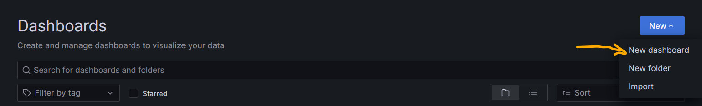
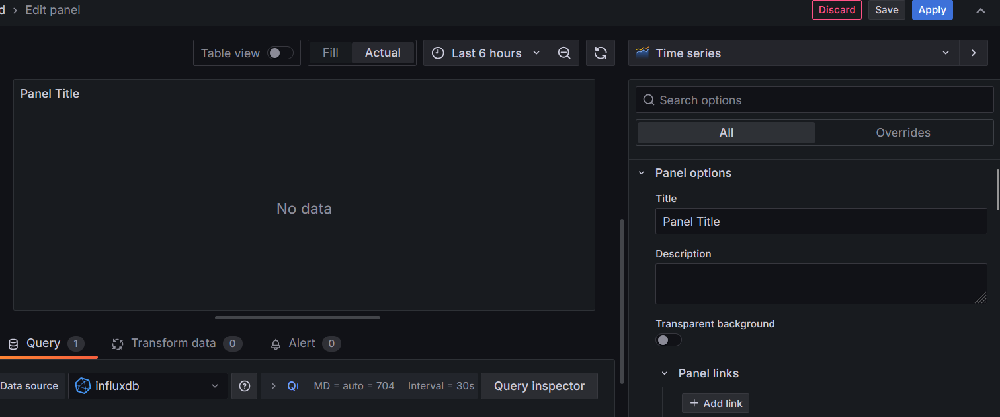
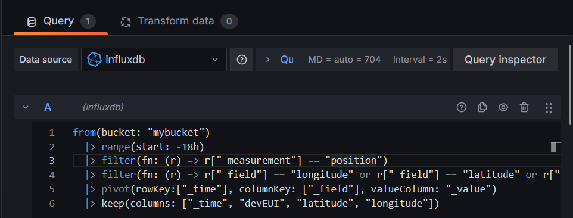
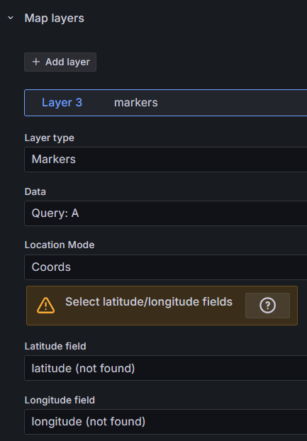

# Creating a Dashboard in Grafana

## Creating the dashboard
1. Navigate to `Dashboard` and click on the `New` button. Select `New dashboard` to create a new dashboard.  
   
2. Click on the `Add Visualization` button and select `influxdb`. You should see the following:  
   

## Adding a map and data

1. Click on the `Time series` button to change the panel visualization and select `GeoMap`.
2. In the properties section, choose a Title. For example, `Map position`.
3. In the `Map view` section, click on the `View` button and select `Fit to data`.
4. At the bottom of the model panel, add the following InfluxDB query to retrieve the Longitude and Latitude positions based on `devEUI`:
```txt
from(bucket: "mybucket")
  |> range(start: v.timeRangeStart, stop: v.timeRangeStop))
  |> filter(fn: (r) => r["_measurement"] == "position")
  |> filter(fn: (r) => r["_field"] == "longitude" or r["_field"] == "latitude" or r["_field"] == "devEUI")
  |> pivot(rowKey:["_time"], columnKey: ["_field"], valueColumn: "_value")
  |> keep(columns: ["_time", "devEUI", "latitude", "longitude"])
```   

 **Explanation:**
 ```txt
    - `v.timeRangeStart` and `v.timeRangeStop` depend on the selected time range. For example, choosing "Past 12h" will select data from the past 12 hours up to the present.
    - The `filter` function selects the measurement (database table) and data fields.
    - The `pivot` function uses `_time` as the unique attribute and consolidates all fields into a single table.
    - The `keep` function selects only the specified columns. keep function select only colums as you want
```
5. In the `Map layers` section, configure the following attributes:
    - `Layer type`: `Markers`
    - `Data`: `Query: A`
    - `Location mode`: `Coords`
    - `Latitude and Longitude`: `latitude, longitude`

    

6. Click the `Save` button to save your changes.

## Changing the dashboard name

1. Click on the `settings` button (gear icon).
2. Enter a new title name. For example, `Dashboard_realtime_bus`.
