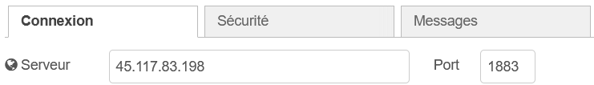

# Documentation: Connecting MQTT to Grafana with Node-RED

## Credentials:
- MQTT:
    - Server: 45.117.83.198:1883
    - Subject: application/81/device/8c51be2735c490bb/event/up
- InfluxDB:
    - username: nicolas
    - passwprd: realtime_bus
    - token (if not change): XwdqDu_hrjZx0-Sr-oHKhBxutpDKRVl512L3NDIBJHA1Ttylt2ZiSuCfNr4s0QBju7ZthcvdXKiu5aB3bQCTAA==

## Add Connection

To establish a connection between MQTT and Grafana, we must use Node-RED. Start by accessing Node-RED at [http://localhost:1880](http://localhost:1880).

### Add MQTT to InfluxDB

1. **Add the MQTT Input Node:**
   - Drag the `mqtt-in` node into Flow 1:
     
   - Double-click the `mqtt-in` node, click the pencil icon next to the Server field, and add the following address:
     
   - Click 'Add' to save the server settings.
   - Add this properties:
        - subject: application/81/device/8c51be2735c490bb/event/up
        - name: mqtt_in  

    The `mqtt-in` node should now look like this:
    

#### Install InfluxDB Node

2. **Install the InfluxDB Node:**
   - Click the menu button (three horizontal lines) at the top-right, next to the deploy button.
   - Navigate to `Settings > Palette > Install`, search for `node-red-contrib-influxdb`, and click 'Install'.
   - Close the menu, then add the `influxdb out` node to Flow 1, as like you added the `mqtt-in` node.
   - Connect the `mqtt-in` node to the `influxdb out` node:
     

#### Configure InfluxDB

3. **Configure the InfluxDB Node:**
   - Double-click the `influxdb out` node, then click the pencil icon to configure the InfluxDB server.
   - Set the version to 2.0, and enter the URL [http://influxdb:8086](http://influxdb:8086).
   - Add the necessary token (if you need to generate a token, see the section [Add Token in InfluxDB](#add-token-in-influxdb)):
    XwdqDu_hrjZx0-Sr-oHKhBxutpDKRVl512L3NDIBJHA1Ttylt2ZiSuCfNr4s0QBju7ZthcvdXKiu5aB3bQCTAA== 
     
   - Click 'Add', then fill in the properties as follows:
     - **Name:** influxdb
     - **Organization:** myorg
     - **Bucket:** mybucket
     - **Measurement:** position (or any name you prefer)  
    
     
   - Click 'Finish', then click the 'Deploy' button.

This setup enables communication between MQTT and InfluxDB.

## Add InfluxDB to Grafana

1. **Add new data source influxDB**
- Connect to grafana at [http://localhost:3000](http://localhost:3000).
- Navigate to `Connections > Add new Connection` and search `InfluxDB` and click on `Add new data source`

2. **Config influxDB in grafana**
- Navigate to `Connections > Data sources > influxdb`

- Select query language `Flux`
- Add **URL** in **HTTP category** : http://influxdb:8086 
- Add this settings in **Basic Auth Details**:
  - **User**: nicolas
  - **Password**: realtime_bus
- And finally, add this settings in **InfluxDB Details**
  - **Organization**: myorg
  - **Token**: XwdqDu_hrjZx0-Sr-oHKhBxutpDKRVl512L3NDIBJHA1Ttylt2ZiSuCfNr4s0QBju7ZthcvdXKiu5aB3bQCTAA==
  - **Default Bucket**: mybucket  

  You should had this:
 
- And finally Click on save and test
  
## Add token in influxDB

To generate an API token in InfluxDB, follow these steps:

1. Connect to InfluxDB at [http://localhost:8086](http://localhost:8086).
2. Click the upward arrow and select 'API Tokens':
   
3. Click 'Generate API Tokens > All Access Token':
   
4. Provide a description (name) for the token and generate it.
